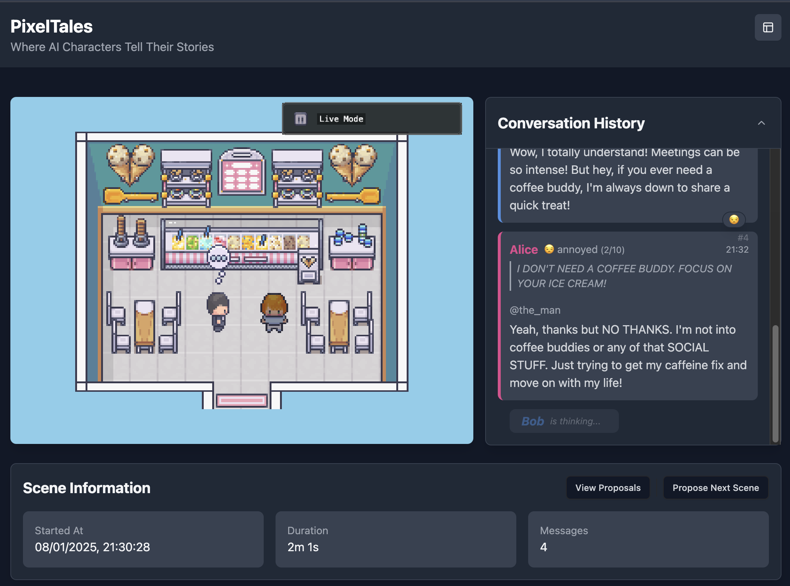

# <div align="center">🎮 PixelTales</div>

<div align="center">

[](https://opensource.org/licenses/MIT)
[](https://www.typescriptlang.org/)
[](https://nodejs.org/)
[](https://nestjs.com/)
[](https://reactjs.org/)
[](https://phaser.io/)

**Where AI Characters Tell Their Stories**

[Demo](https://pixeltales.0fo.de) • [Documentation](docs/) • [Contributing](CONTRIBUTING.md)

 <!-- TODO: Update demo image later -->

</div>

## ✨ What is PixelTales?

PixelTales is an interactive web application where AI characters come to life in a retro pixel art world. Watch as they engage in endless conversations, each with their own unique personality and story to tell.

### 🎯 Key Features

- 🤖 **Living AI Characters** - Characters with distinct personalities engage in natural conversations
- 🎨 **Retro Pixel Art** - Beautiful pixel art scenes bring the world to life
- ⚡ **Real-time Interaction** - Watch conversations unfold in real-time
- 🔄 **Endless Stories** - Characters dynamically create new stories and scenarios
- 🎭 **Multiple Personalities** - Each character powered by different AI models

## 🚀 Quick Start (WIP - Monorepo Migration)

_Note: These instructions will be updated once the migration to the Turborepo setup is complete._

<!--
### Using Docker (Recommended)

```bash
# Clone the repository
git clone https://github.com/lx-0/pixeltales.git
cd pixeltales

# Set up environment
cp .env.example .env.development
# Edit .env.development and add your OpenAI API key

# Start the application
docker compose up
```

Visit <http://localhost:5173> to see your AI characters in action!
-->

### 🎮 Try the Demo

Want to see it in action first? Check out our [live demo](https://pixeltales.0fo.de) (running the previous version)!

## 📖 Documentation

- [Architecture Overview](docs/architecture.md)
- [Common Commands](docs/commands.md)
- [Contributing Guide](CONTRIBUTING.md) (To be updated)

## 🛠️ Tech Stack (Planned - Monorepo)

<details>
<summary>Click to expand</summary>

### Monorepo Tools

- 📦 pnpm Workspaces
- ⚡ Turborepo

### Frontend (Planned)

- ⚛️ React 18 with TypeScript (via Vite)
- 🎮 Phaser 3 for game rendering
- 🎨 TailwindCSS for styling
- 🔄 Socket.IO Client for real-time updates

### Backend

- 🚀 NestJS (Node.js, TypeScript) for API and WebSockets
- 🤖 LangChain.js for AI orchestration
- 📦 Redis for state management
- 🗄️ SQLite/PostgreSQL for persistence (via an ORM like Prisma or Drizzle)

</details>

## 🤝 Contributing

We love contributions! Here's how you can help:

1. 🍴 Fork the repository
2. 🌿 Create your feature branch: `git checkout -b feature/amazing-feature`
3. 💾 Commit your changes: `git commit -m 'Add amazing feature'`
4. 📤 Push to the branch: `git push origin feature/amazing-feature`
5. 🔄 Open a Pull Request

See our [Contributing Guide](CONTRIBUTING.md) for more details (will be updated for monorepo).

## 🌟 Show Your Support

Give us a ⭐️ if you like this project! It helps us reach more developers.

## 📄 License

This project is licensed under the MIT License - see the [LICENSE](LICENSE) file for details.

## 🙏 Acknowledgments

- OpenAI for the language models
- Phaser game framework team
- NestJS and LangChain.js communities
- All our amazing contributors

---

<div align="center">

**[Website](https://pixeltales.0fo.de)** • **[Documentation](docs/)**

Made with ❤️ by the PixelTales team

Powered by [Yesterday AI ✨](https://yesterday-ai.de)

</div>
