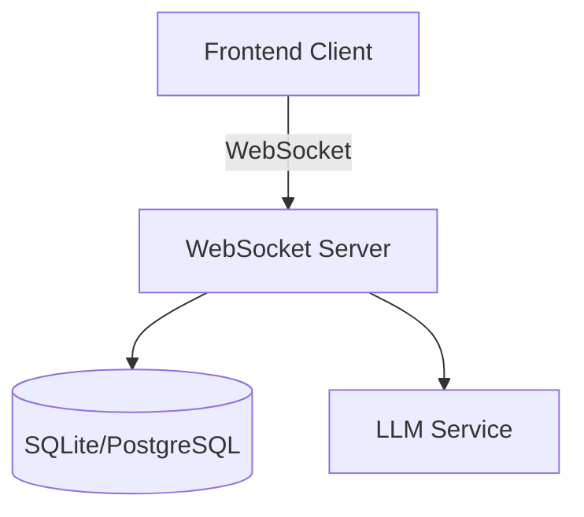
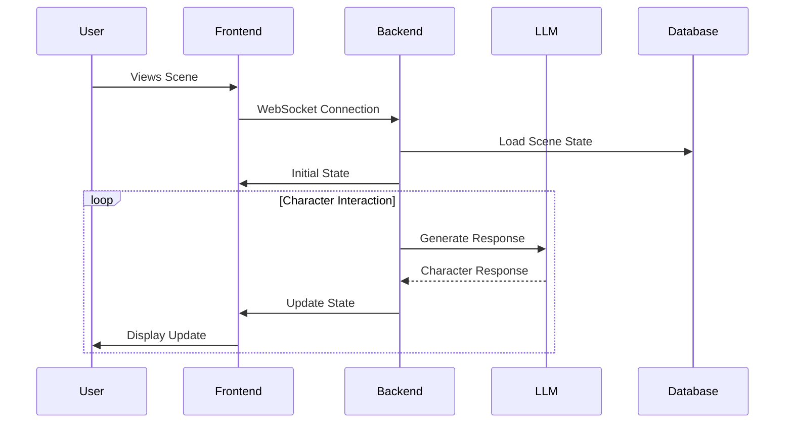

# Architecture Overview

PixelTales is built with a modern, scalable architecture that enables real-time AI character interactions in a pixel art environment.

## System Architecture



## Core Components

### Frontend Architecture

1. **React Application**
   - Built with Vite and TypeScript
   - State management with React hooks
   - Real-time updates via Socket.IO
   - Responsive design with TailwindCSS

2. **Game Engine (Phaser 3)**
   - Scene management
   - Character animations
   - Speech bubble system
   - Interactive elements

3. **WebSocket Client**
   - Real-time state synchronization
   - Automatic reconnection
   - Event-based communication
   - State management integration

### Backend Architecture

1. **FastAPI Application**
   - WebSocket server with Socket.IO
   - Type validation with Pydantic
   - Async request handling
   - SQLite/PostgreSQL integration

2. **LangChain Integration**
   - Multi-agent conversation system
   - Memory management
   - Tool integration
   - Model-agnostic design

3. **State Management**
   - SQLite/PostgreSQL for persistence
   - In-memory state for active sessions
   - WebSocket event broadcasting
   - Scene state management

## Data Flow

### Character Interaction Flow



### State Management Flow

1. **Scene State**
   - Character positions
   - Conversation history
   - Active interactions
   - Visitor count

2. **Character State**
   - Current action
   - Position and direction
   - Mood and emotions
   - Conversation context

3. **Message Flow**
   - Content validation
   - Token management
   - Response timing
   - History tracking

## Directory Structure

### Frontend Structure

```
frontend/
├── src/
│   ├── components/    # React components
│   ├── game/         # Phaser game logic
│   │   ├── scenes/   # Game scenes
│   │   ├── objects/  # Game objects
│   │   └── managers/ # State managers
│   ├── hooks/        # Custom React hooks
│   ├── services/     # API services
│   ├── store/        # State management
│   └── utils/        # Utility functions
```

### Backend Structure

```
backend/
├── app/
│   ├── api/         # API endpoints
│   ├── core/        # Core configuration
│   ├── db/          # Database models
│   ├── models/      # Pydantic models
│   ├── schemas/     # API schemas
│   ├── services/    # Business logic
│   └── utils/       # Utility functions
```

## Security Considerations

1. **API Security**
   - Rate limiting
   - Input validation
   - CORS configuration
   - Authentication (future)

2. **Data Protection**
   - Environment variables
   - Secure WebSocket
   - Database security
   - API key management

3. **Error Handling**
   - Graceful degradation
   - Error logging
   - User feedback
   - Recovery strategies

## Scalability

1. **Horizontal Scaling**
   - Containerized deployment
   - Load balancing
   - Database sharding
   - Cache distribution

2. **Performance Optimization**
   - Asset optimization
   - State compression
   - Batch processing
   - Lazy loading

3. **Monitoring**
   - Error tracking
   - Performance metrics
   - User analytics
   - Resource usage

## Future Considerations

1. **Planned Features**
   - User authentication
   - Custom characters
   - Scene creation
   - Advanced AI tools

2. **Technical Improvements**
   - GraphQL integration
   - WebRTC support
   - PWA capabilities
   - Advanced caching

3. **Infrastructure**
   - Cloud deployment
   - CDN integration
   - Backup systems
   - Disaster recovery
