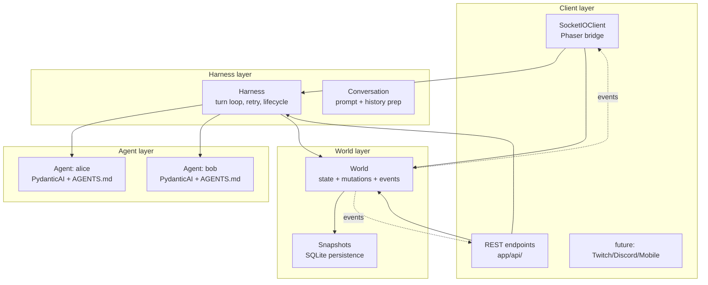

# Architecture

PixelTales is built as a **4-layer agentic system**: Agent / Harness / World / Client. This document is the canonical reference — all future code, naming, and refactoring align to it.

## The Four Layers

### Agent — *the NPC brain*

The LLM-driven reasoning entity. One Agent per character. An Agent has:
- **Identity** — `AGENTS.md` (the agents.md spec): role, personality, traits
- **Capabilities** — `SKILL.md` folders (the agentskills.io spec): callable tools the Agent can invoke
- **Configuration** — `.character.yaml`: model, tier, sprite, default placement

An Agent knows nothing about how it's invoked, where its perception comes from, or where its actions go. Channel-agnostic, scene-agnostic, harness-agnostic.

**Implementation:** `app/agent/llm.py` (`LLMManager` — one PydanticAI `Agent[None, CharacterResponse]` per unique `LLMConfig` hash) + `app/agent/characters/<id>/{AGENTS.md, .character.yaml}` (the seed library; runtime-proposed characters land in `data/characters/`).

### Harness — *the orchestrator*

Owns the agentic loop. Drives turn-taking, paces character output, persists snapshots, retries on transient errors, applies fallbacks on sustained errors. Reads from World to build perception; writes Agent's output back to World. Channel-agnostic — does not know that Phaser exists.

**Implementation:** `app/harness/orchestrator.py` (`Harness` — owns the active scene's tick loop), `app/harness/conversation.py` (turn-taking + history prep), `app/harness/scene_loader.py` + `scene_config_loader.py` (lifecycle).

### World — *the simulated environment*

Server-authoritative state of the scene: positions, characters, time, props, event log, conversation messages. Mutated by Harness, queried by Agents (via Harness for perception), broadcast by Clients (via subscribed events).

The World fires **domain events** (`CharacterActionChanged`, `CharacterMessageAdded`, `VisitorCountChanged`, `EndConversationRequested`, …); subscribers register via `world.subscribe(callback)`. The World does not know who's watching.

**Implementation:** `app/world/state.py` (`World` — mutation API + async event bus), `app/world/events.py` (typed `WorldEvent` dataclasses), `app/world/persistence/snapshots.py` (`SceneStateSnapshotService` — per-scene retention + SQLite).

### Client — *the I/O adapter*

Translates between the World and the outside world. Subscribes to World events, broadcasts them to viewers; receives input from viewers, forwards it to Harness. Multiple Clients can serve the same World simultaneously.

Today there is one Client (Socket.IO bridge to the Phaser game). Tomorrow there can be many: REST polling, Twitch viewer-stream, Discord bot, mobile app.

**Implementation:** `app/client/socketio.py` (`SocketIOClient` — subscribes to `World.subscribe`, owns Socket.IO `connect`/`disconnect` handlers, broadcasts `scene_state` to all viewers). The REST router under `app/api/` is a second Client surface, organized by FastAPI conventions.

## Why this split

Each layer stabilizes a different rate of change:

| Layer | Stability | Changes when… |
|-------|-----------|---------------|
| Agent | High | New character archetypes; new Agent capabilities (skills) |
| Harness | Medium | Turn-taking rules, retry policy, multi-NPC orchestration |
| World | Low (data) / Medium (rules) | Adding spatial reasoning, props, time, weather |
| Client | High | New surface (Twitch, Discord, mobile); wire-format tweaks |

The current code mixes Harness + World + Client in `SceneManager`. Every Client addition (Twitch) or World extension (props, spatial queries) requires touching the same file. The 4-layer split gives each concern its own home.

## Dependency Rules

Imports flow one direction:

```
Client  →  Harness  →  Agent
   ↘         ↓
    →     World
```

Allowed:
- `Client → Harness` (forward visitor input)
- `Client → World` (read state, subscribe to events)
- `Harness → Agent` (invoke for next turn)
- `Harness → World` (read for perception, write for action)

Forbidden:
- `Agent → Harness` — Agent must be invocation-agnostic
- `Agent → World` — Agent receives perception; does not query World directly
- `World → Harness` — World fires events; Harness subscribes
- `World → Client` — World does not know who's watching

Cross-cutting (`app/core/`, `app/db/`, `app/models/`, `app/utils/`) may be imported by any layer.

## Naming Conventions

**Layer names are reserved**: `agent`, `harness`, `world`, `client`. Use as directory and module prefixes. Do not use them for unrelated concepts.

**Classes:**
- `Agent` — per character, PydanticAI-backed
- `Harness` — per scene, owns the agentic loop (replaces `SceneManager`)
- `World` — per scene, holds + mutates state, fires events
- `*Client` suffix per implementation — `SocketIOClient`, `TwitchClient`, `RESTClient`

**Files / dirs:** `app/<layer>/<concern>.py`. Tests follow: `tests/<layer>/test_<concern>.py`.

**Avoid these generic names:**
- `manager` — too vague; pick the layer's vocabulary instead (`Harness`, `World`)
- `service` — same problem
- `handler` — legacy term; if it's I/O it's a Client adapter, if it's orchestration it's Harness
- `gateway` — reserved in this project for the **LLM gateway** (LiteLLM). Do not reuse for the Client layer.

## File Layout (post-refactor)

| Path | Layer | Class |
|------|-------|-------|
| `app/agent/llm.py` | Agent | `LLMManager` |
| `app/agent/characters/<id>/{AGENTS.md, .character.yaml}` | Agent (data) | — (loaded by `app/agent/characters/__init__.py`) |
| `app/agent/characters/<id>/skills/<name>/SKILL.md` | Agent (data, planned) | — (per agentskills.io, see ROADMAP) |
| `app/harness/orchestrator.py` | Harness | `Harness` |
| `app/harness/conversation.py` | Harness | `ConversationManager` |
| `app/harness/scene_loader.py` | Harness | `SceneService` |
| `app/harness/scene_config_loader.py` | Harness | `SceneConfigService` |
| `app/world/state.py` | World | `World` |
| `app/world/events.py` | World | `WorldEvent` + 7 typed subclasses |
| `app/world/persistence/snapshots.py` | World | `SceneStateSnapshotService` |
| `app/client/socketio.py` | Client | `SocketIOClient` |
| `app/api/endpoints/{scenes,config,characters}.py` | Client (REST) | FastAPI routers |
| `app/main.py` | Wiring | composes Harness + SocketIOClient at module load |
| `app/core/`, `app/db/`, `app/models/`, `app/utils/`, `app/prompts/` | Cross-cutting | — |

## Refactor History

All 5 phases shipped 2026-04-24. The split was executed in 2 parallel git worktrees: one subagent ran B→C→D sequentially (shared file surface), another ran E in parallel (independent). Total: 5 commits + 2 merge commits + 1 hotfix.

| Phase | Commit | What landed |
|-------|--------|-------------|
| A | `d37b3da` | Docs only — this file + ROADMAP layer labels + CLAUDE.md pointer |
| B | `a4e8a23` | Extract `World` (state.py + mutations + events.py + persistence/snapshots.py) |
| C | `959a9f2` | Rename `SceneManager` → `Harness`; files moved into `app/harness/` |
| D | `fdb8b1e` | Extract `SocketIOClient`; Harness no longer holds `sio` reference; `RUF006` lint ignore resolved |
| E | `30e494b` | Move `services/llm_manager.py` → `agent/llm.py`, `characters/` → `agent/characters/` |
| (merge) | `128b180` + `5363f8b` | Phase-E and Phase-BCD branches merged back into `origin` |
| (fix) | `f507d2c` | structlog `event=` kwarg shadowed reserved key in `world/state.py` + `client/socketio.py`; tests didn't catch because they don't fire WorldEvents — caught by `pnpm diag` browser smoke on first `VisitorCountChanged` broadcast |

Behavior preserved end-to-end: 38 tests pass, mypy clean (37 source files), coverage 64.60% (was 62.92%), browser smoke green (Bob + Alice render, OpenAI 200 OK, World events broadcast).

## System Diagram


```mermaid
graph TB
  subgraph Client_Layer[Client layer]
    SocketIO[SocketIOClient<br/>Phaser bridge]
    REST[REST endpoints<br/>app/api/]
    Future[future: Twitch/Discord/Mobile]
  end

  subgraph Harness_Layer[Harness layer]
    H[Harness<br/>turn loop, retry, lifecycle]
    Conv[Conversation<br/>prompt + history prep]
  end

  subgraph Agent_Layer[Agent layer]
    A1[Agent: alice<br/>PydanticAI + AGENTS.md]
    A2[Agent: bob<br/>PydanticAI + AGENTS.md]
  end

  subgraph World_Layer[World layer]
    W[World<br/>state + mutations + events]
    Snap[Snapshots<br/>SQLite persistence]
  end

  SocketIO --> H
  SocketIO --> W
  REST --> H
  REST --> W
  H --> A1
  H --> A2
  H --> W
  W --> Snap
  W -. events .-> SocketIO
  W -. events .-> REST
```

## Tech Stack (current)

**Backend:** FastAPI 0.118+, Python 3.12, PydanticAI 1.86 (LLM layer), SQLAlchemy async + SQLite/PostgreSQL, Socket.IO server (`python-socketio`), structlog, slowapi (rate-limit), Prometheus instrumentator. Package manager: `uv`. Lint: ruff. Types: mypy strict.

**Frontend:** React 19 + Vite + TypeScript, Phaser 3.90 (Game Engine), Tailwind 4 + shadcn/ui, Redux-free (`useState` + React Query), Socket.IO client. Package manager: `pnpm`. Lint+format: Biome.

**Cross-stack:** OpenAPI codegen (`openapi-typescript` + `openapi-fetch`) for typed REST contracts; per-Socket-event typed schemas via `socket-events.ts` mapping generated Pydantic schemas to `ServerToClientEvents`/`ClientToServerEvents`.

**LLM routing:** LiteLLM gateway at `llm.yester.cloud` when `LITELLM_BASE_URL` is set; falls back to direct OpenAI/Anthropic SDK calls otherwise. **Note: "gateway" is reserved for this LLM-routing layer** — don't reuse the term for the Client layer.

## Cross-Cutting Concerns

**Security:** CORS tightened (Phase 3a); slowapi rate limits (100/min global, 5/min on `/scenes/propose`, 30/min on `/vote`); Pydantic `extra="forbid"` on write boundaries.

**Observability:** Prometheus metrics at `/metrics` (`pixeltales_visitors_active`, `pixeltales_messages_total{character}`, `pixeltales_llm_response_seconds{provider,model}`). OpenTelemetry traces planned (waiting on collector). Grafana board planned (see ROADMAP).

**Persistence:** Alembic migrations as schema source-of-truth. Two tables: `scene_configs` (proposal storage) + `scene_state_snapshots` (time-series with per-scene retention configurable via `SCENE_SNAPSHOT_RETENTION`, default 10).
